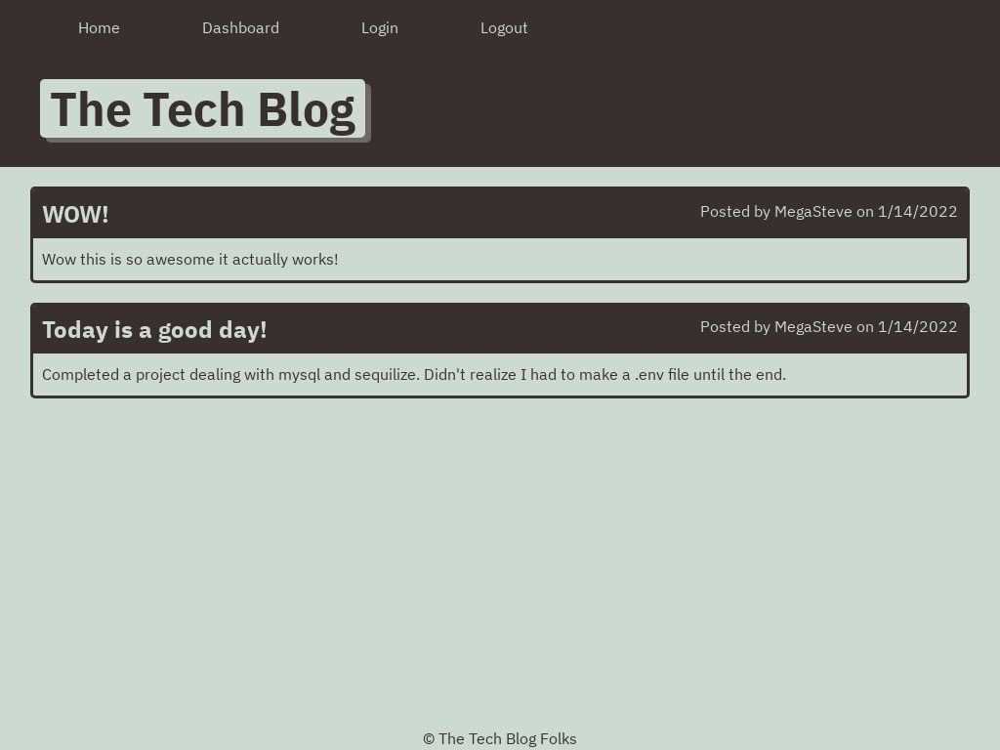

# Tech-Blog
## Author 
- [Steve Koutsodontis](https://github.com/SteveKoutsodontis)

## Description

* This Tech Blog is a CMS- Style blog site, Where developers can publish blog's and comment on other user's posts. The Tech Blog was deployed using Heroku. When the users first comes upon the page they will see others post's. In order to create a post or comment on another's post they must first sign up or login. Then they will be able to create there own posts and comment on any other posts. 

## Built With 

* Express
* Sequelize
* bcrypt
* dotenv
* HTML
* CSS
* node.js
* handlebars 

## Installation Instructions

If you want to edit applcation you must have a Github account, download Visual Studio Code, Install Node.JS, and Inquirer.

[Create a Github account](https://github.com)

[Download Visual Studio](https://code.visualstudio.com/download/)

[Download node.js](https://nodejs.org/en/download/)

Clone the Github project.

To install packages dependencies in package.json, open a console in the correct directory and enter: npm i

## Usage 

* [Deployed Link](https://tech-blog-smk.herokuapp.com/)

First login to mysql database: 
mysql -u root -p
password

Next in git bash command line:
npm start

And finally in your browser you will goto:
localhost:3001

## Screen Shots

### License: 
 

Copyright (c) [2021] [Steve Koutsodontis]

Permission is hereby granted, free of charge, to any person obtaining a copy
of this software and associated documentation files (the "Software"), to deal
in the Software without restriction, including without limitation the rights
to use, copy, modify, merge, publish, distribute, sublicense, and/or sell
copies of the Software, and to permit persons to whom the Software is
furnished to do so, subject to the following conditions:

The above copyright notice and this permission notice shall be included in all
copies or substantial portions of the Software.

THE SOFTWARE IS PROVIDED "AS IS", WITHOUT WARRANTY OF ANY KIND, EXPRESS OR
IMPLIED, INCLUDING BUT NOT LIMITED TO THE WARRANTIES OF MERCHANTABILITY,
FITNESS FOR A PARTICULAR PURPOSE AND NONINFRINGEMENT. IN NO EVENT SHALL THE
AUTHORS OR COPYRIGHT HOLDERS BE LIABLE FOR ANY CLAIM, DAMAGES OR OTHER
LIABILITY, WHETHER IN AN ACTION OF CONTRACT, TORT OR OTHERWISE, ARISING FROM,
OUT OF OR IN CONNECTION WITH THE SOFTWARE OR THE USE OR OTHER DEALINGS IN THE
SOFTWARE.